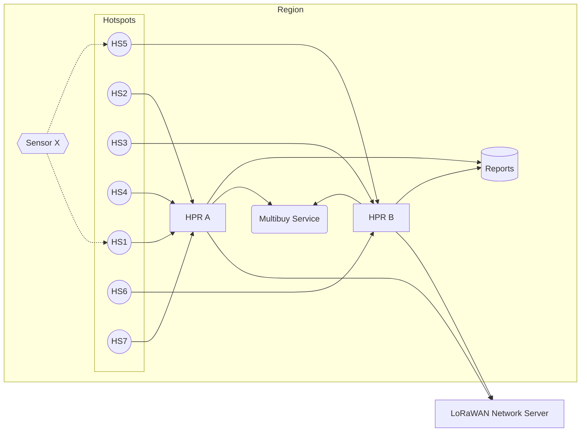

# Multibuy Service

In the Helium Packet Router architecture, there are multiple load balanced HPRs per region (Europe, Asia, etc). This presents the chance that two geographically close Hotspots in one region actually report to different instances of HPR. Through this double connection, HPRs alone cannot determine whether a packet has already been purchased by the network already.

e.g. One Hotspot reports to HPR A, One Hotspot reports to HPR B. The 'multibuy' is set to 'one', the network may incorrectly transmit two packet reports to the LNS (and packet verifier).

Multi-Buy service fixes this non-communication by allowing HPRs to communicate within a region in order to limit the number of packets purchased by the network (based on multi-buy preference).

As packets come in to HPR A and HPR B, they will check in with Multi-Buy service to ensure the total requested packets is not exceeded.

## Features

- Distributed packet counter across load-balanced HPR instances
- Hotspot and region deny lists, editable at runtime over HTTP
- Admin API + metrics dashboard
- Prometheus metrics endpoint
- Automatic cache cleanup (configurable, default 30 minutes)
- Graceful shutdown via SIGTERM/SIGINT

## Diagram



## Building

```bash
cargo build --release
```

## Running

```bash
# With config file
multi_buy_service -c settings.toml server

# Or with environment variables only
MB__GRPC_LISTEN=0.0.0.0:6080 multi_buy_service server
```

## Testing

```bash
cargo nextest run
```

## Docker

```bash
docker build -t multibuy-service .

docker run -p 6080:6080 -p 6081:6081 -p 19011:19011 multibuy-service
```

## Configuration

All settings can be configured via a TOML file or environment variables prefixed with `MB__` (double-underscore separator).

```toml
# log settings for the application (RUST_LOG format)
# Env: MB__LOG
log = "INFO"

# Listen address for gRPC requests
# Env: MB__GRPC_LISTEN
grpc_listen = "0.0.0.0:6080"

# Base58-encoded hotspot public keys to deny
# Env: MB__DENIED_HOTSPOTS
# denied_hotspots = []

# Region names to deny (e.g., "US915", "EU868")
# Env: MB__DENIED_REGIONS
# denied_regions = []

# Prometheus metrics endpoint
[metrics]
# Env: MB__METRICS__ENDPOINT
endpoint = "0.0.0.0:19011"

# Admin API and metrics dashboard
[api]
# Env: MB__API__ENABLED
enabled = true
# Env: MB__API__LISTEN
listen = "0.0.0.0:6081"
# Bearer token required on API requests; unset = unauthenticated
# Env: MB__API__AUTH_TOKEN
# auth_token = "change-me"

# Cache cleanup interval (humantime format)
# Env: MB__CLEANUP_TIMEOUT
# cleanup_timeout = "30 minutes"
```

### Environment Variables

| Variable | Description | Default |
|----------|-------------|---------|
| `MB__LOG` | RUST_LOG format log level | `INFO` |
| `MB__GRPC_LISTEN` | gRPC listen address | `0.0.0.0:6080` |
| `MB__METRICS__ENDPOINT` | Prometheus metrics listen address | `0.0.0.0:19011` |
| `MB__CLEANUP_TIMEOUT` | Cache cleanup interval | `30 minutes` |
| `MB__DENIED_HOTSPOTS` | Base58-encoded hotspot public keys to deny | `[]` |
| `MB__DENIED_REGIONS` | Region names to deny (e.g., US915, EU868) | `[]` |
| `MB__API__ENABLED` | Run the admin API and dashboard | `true` |
| `MB__API__LISTEN` | Admin API / dashboard listen address | `0.0.0.0:6081` |
| `MB__API__AUTH_TOKEN` | Bearer token required on API requests | unset (no auth) |

## Metrics

| Metric | Type | Description |
|--------|------|-------------|
| `multi_buy_hit_total` | Counter | Total inc requests received |
| `multi_buy_denied_total` | Counter | Total requests denied by deny lists |
| `multi_buy_cache_size` | Gauge | Number of entries in the cache |
| `multi_buy_cache_cleaned_total` | Counter | Total entries removed by cache cleanup |
| `multi_buy_deny_list_size` | Gauge | Deny list entries, labelled `kind="hotspots"\|"regions"` |

Metrics are exposed at `http://{endpoint}/metrics` in Prometheus format.

## Dashboard

The admin listener serves a dashboard at `http://{api.listen}/` — request and
deny rates, cache size, request latency quantiles, the full metric table and the
raw scrape payload, plus controls to edit the deny lists. It polls every 5
seconds, is self-contained (no CDN or outbound network access), and renders the
same numbers Prometheus scrapes.

If `api.auth_token` is set the page prompts for it on first load and keeps it in
`localStorage`.

## Admin API

Deny-list changes take effect on the very next `inc` request — no restart and no
config reload. They are **in-memory only**: after a restart the service is back
to whatever `denied_hotspots` / `denied_regions` say, so persist anything
long-lived in your config or deployment manifest.

All `/api/v1/*` routes require `Authorization: Bearer <api.auth_token>` when that
token is configured. `/` and `/health` are always open.

| Method | Path | Description |
|--------|------|-------------|
| `GET` | `/` | Metrics dashboard |
| `GET` | `/health` | Liveness check |
| `GET` | `/api/v1/info` | Version, listen addresses, uptime |
| `GET` | `/api/v1/metrics` | Prometheus payload, rendered in-process |
| `GET` | `/api/v1/regions` | Every region name the proto accepts |
| `GET` | `/api/v1/deny-list` | Both deny lists |
| `GET` | `/api/v1/deny-list/hotspots` | Denied hotspots |
| `POST` | `/api/v1/deny-list/hotspots` | Add hotspots |
| `DELETE` | `/api/v1/deny-list/hotspots` | Remove hotspots (JSON body) |
| `DELETE` | `/api/v1/deny-list/hotspots/{key}` | Remove one hotspot |
| `GET` | `/api/v1/deny-list/regions` | Denied regions |
| `POST` | `/api/v1/deny-list/regions` | Add regions |
| `DELETE` | `/api/v1/deny-list/regions` | Remove regions (JSON body) |
| `DELETE` | `/api/v1/deny-list/regions/{name}` | Remove one region |

Write bodies accept a single value or a batch:

```json
{"hotspot": "13QZwkEXgjE3WzWzy6DvJ1dqKsZM5s3fc4pkFpFb2yME2nRRnJv"}
{"hotspots": ["13QZwk…", "11z69e…"]}
{"region": "EU868"}
{"regions": ["EU868", "AS923_1"]}
```

Batches are validated before anything is applied: an unknown region name or a
hotspot key that isn't valid base58check returns `400` and changes nothing.
Hotspot keys are checked because HPR sends the base58 address as bytes and the
deny list matches it exactly — a typo would otherwise sit in the list, silently
matching nothing.

Responses report what actually changed alongside the resulting list:

```json
{
  "changed": ["EU868"],
  "unchanged": [],
  "regions": ["EU868"]
}
```

### Examples

```bash
API=http://localhost:6081
TOKEN=change-me   # omit the header entirely if api.auth_token is unset

# View the current deny lists
curl -s -H "Authorization: Bearer $TOKEN" $API/api/v1/deny-list

# Deny a region
curl -s -X POST -H "Authorization: Bearer $TOKEN" \
  -H 'Content-Type: application/json' \
  -d '{"region":"EU868"}' $API/api/v1/deny-list/regions

# Deny two hotspots at once
curl -s -X POST -H "Authorization: Bearer $TOKEN" \
  -H 'Content-Type: application/json' \
  -d '{"hotspots":["13QZwkEXgjE3WzWzy6DvJ1dqKsZM5s3fc4pkFpFb2yME2nRRnJv"]}' \
  $API/api/v1/deny-list/hotspots

# Stop denying a region
curl -s -X DELETE -H "Authorization: Bearer $TOKEN" \
  $API/api/v1/deny-list/regions/EU868
```
