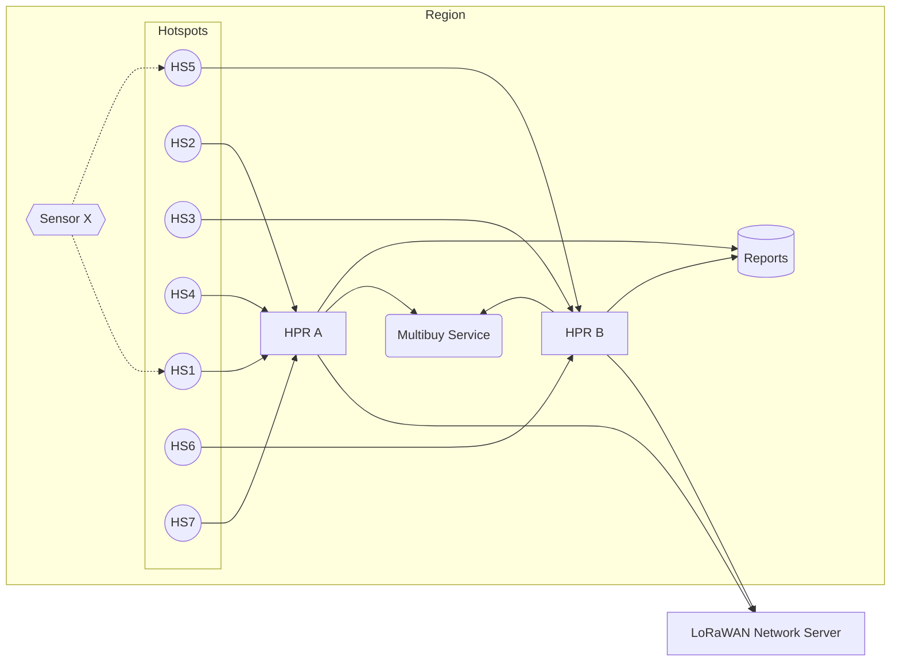

# Multibuy Service

In the Helium Packet Router architecture, there are multiple load balanced HPRs per region (Europe, Asia, etc). This presents the chance that two geographically close Hotspots in one region actually report to different instances of HPR. Through this double connection, HPRs alone cannot determine whether a packet has already been purchased by the network already.

e.g. One Hotspot reports to HPR A, One Hotspot reports to HPR B. The 'multibuy' is set to 'one', the network may incorrectly transmit two packet reports to the LNS (and packet verifier).

Multi-Buy service fixes this non-communication by allowing HPRs to communicate within a region in order to limit the number of packets purchased by the network (based on multi-buy preference).

As packets come in to HPR A and HPR B, they will check in with Multi-Buy service to ensure the total requested packets is not exceeded.

## Features

- Distributed packet counter across load-balanced HPR instances
- Hotspot and region deny lists, editable at runtime over HTTP and persisted across restarts
- Per-entry denial counts, so you can see which rules are actually firing
- Admin API + metrics dashboard, with Angry Purple Tiger animal names for hotspots
- Prometheus metrics endpoint
- Automatic cache cleanup (configurable, default 30 minutes)
- Graceful shutdown via SIGTERM/SIGINT

## Diagram



## Building

```bash
cargo build --release
```

## Running

```bash
# With config file
multi_buy_service -c settings.toml server

# Or with environment variables only
MB__GRPC_LISTEN=0.0.0.0:6080 multi_buy_service server
```

## Testing

```bash
cargo nextest run
```

## Docker

```bash
docker build -t multibuy-service .

# -v keeps deny-list changes across container replacement
docker run -p 6080:6080 -p 6081:6081 -p 19011:19011 \
  -v multibuy-data:/app/data multibuy-service
```

## Configuration

All settings can be configured via a TOML file or environment variables prefixed with `MB__` (double-underscore separator).

```toml
# log settings for the application (RUST_LOG format)
# Env: MB__LOG
log = "INFO"

# Listen address for gRPC requests
# Env: MB__GRPC_LISTEN
grpc_listen = "0.0.0.0:6080"

# Base58-encoded hotspot public keys to deny
# Env: MB__DENIED_HOTSPOTS
# denied_hotspots = []

# Region names to deny (e.g., "US915", "EU868")
# Env: MB__DENIED_REGIONS
# denied_regions = []

# Where admin API deny-list changes are persisted; "" = in memory only
# Env: MB__DENY_LIST_STORE
# deny_list_store = "deny-list.json"

# Prometheus metrics endpoint
[metrics]
# Env: MB__METRICS__ENDPOINT
endpoint = "0.0.0.0:19011"

# Admin API and metrics dashboard
[api]
# Env: MB__API__ENABLED
enabled = true
# Env: MB__API__LISTEN
listen = "0.0.0.0:6081"
# Bearer token required on API requests; unset = unauthenticated
# Env: MB__API__AUTH_TOKEN
# auth_token = "change-me"

# Cache cleanup interval (humantime format)
# Env: MB__CLEANUP_TIMEOUT
# cleanup_timeout = "30 minutes"
```

### Environment Variables

| Variable | Description | Default |
|----------|-------------|---------|
| `MB__LOG` | RUST_LOG format log level | `INFO` |
| `MB__GRPC_LISTEN` | gRPC listen address | `0.0.0.0:6080` |
| `MB__METRICS__ENDPOINT` | Prometheus metrics listen address | `0.0.0.0:19011` |
| `MB__CLEANUP_TIMEOUT` | Cache cleanup interval | `30 minutes` |
| `MB__DENIED_HOTSPOTS` | Base58-encoded hotspot public keys to deny | `[]` |
| `MB__DENIED_REGIONS` | Region names to deny (e.g., US915, EU868) | `[]` |
| `MB__API__ENABLED` | Run the admin API and dashboard | `true` |
| `MB__API__LISTEN` | Admin API / dashboard listen address | `0.0.0.0:6081` |
| `MB__API__AUTH_TOKEN` | Bearer token required on API requests | unset (no auth) |
| `MB__DENY_LIST_STORE` | Where API deny-list changes are persisted (`""` disables) | `deny-list.json` |

## Metrics

| Metric | Type | Description |
|--------|------|-------------|
| `multi_buy_hit_total` | Counter | Total inc requests received |
| `multi_buy_denied_total` | Counter | Total requests denied by deny lists |
| `multi_buy_cache_size` | Gauge | Number of entries in the cache |
| `multi_buy_cache_cleaned_total` | Counter | Total entries removed by cache cleanup |
| `multi_buy_deny_list_size` | Gauge | Deny list entries, labelled `kind="hotspots"\|"regions"` |
| `multi_buy_denied_by_reason_total` | Counter | Denials by matching rule, labelled `reason="hotspot"\|"region"\|"both"` |
| `multi_buy_denied_by_region_total` | Counter | Denials attributed to a region, labelled `region="EU868"` etc. |

Metrics are exposed at `http://{endpoint}/metrics` in Prometheus format.

`multi_buy_denied_total` is unchanged and still counts every denial once. The two
labelled counters break it down; `reason="both"` means a request matched a denied
hotspot *and* a denied region, so
`sum(multi_buy_denied_by_reason_total) == multi_buy_denied_total`.

There is deliberately **no per-hotspot Prometheus counter**: that would create one
series per denied address, which is unbounded from Prometheus's point of view.
Per-hotspot counts come from the admin API instead, where cardinality costs
nothing. Region labels are bounded by the proto enum (~28 values), so those are
safe.

## Seeing which rules are firing

Every deny-list entry carries its own denial count and the time it last matched,
so a list can be audited in use rather than guessed at:

```bash
curl -s $API/api/v1/deny-list | jq
```

```json
{
  "hotspots": [
    {
      "address": "13QZwkEXgjE3WzWzy6DvJ1dqKsZM5s3fc4pkFpFb2yME2nRRnJv",
      "name": "mean-gingerbread-seal",
      "hits": 3,
      "last_denied": 1790132996
    }
  ],
  "regions": [
    { "region": "EU868", "hits": 6, "last_denied": 1790132996 },
    { "region": "KR920", "hits": 0 }
  ],
  "activity_since_start": {
    "hotspots": { "denied": 3, "never_matched": 0 },
    "regions": { "denied": 6, "never_matched": 1 }
  }
}
```

Entries are returned busiest first. An entry with `hits: 0` and no `last_denied`
has **never matched** — a rule that is stale, or one that was never going to work
(a mistyped address, say). `never_matched` counts them per list, and the dashboard
dims those rows.

A request matching a denied hotspot *and* a denied region is counted against both
entries, so neither list under-reports. That is why the two `denied` totals above
can sum to more than `multi_buy_denied_total`.

Counts are per process: they describe traffic, not configuration, so they reset on
restart and are never written to the store. Removing and re-adding an entry
restarts its count; re-adding one that is already denied leaves it alone.

Each denial is also logged at INFO with the matching rule and the region *name*:

```
denied by deny list key=both-1 count=1 hotspot="13QZwk…" region=EU868 reason="both"
```

## Dashboard

The admin listener serves a dashboard at `http://{api.listen}/` — request and
deny rates, cache size, request latency quantiles, the full metric table and the
raw scrape payload, plus controls to edit the deny lists. It polls every 5
seconds, is self-contained (no CDN or outbound network access), and renders the
same numbers Prometheus scrapes.

If `api.auth_token` is set the page prompts for it on first load and keeps it in
`localStorage`.

## Admin API

Deny-list changes take effect on the very next `inc` request — no restart and no
config reload — and are persisted so they survive one (see
[Persistence](#persistence)).

All `/api/v1/*` routes require `Authorization: Bearer <api.auth_token>` when that
token is configured. `/` and `/health` are always open.

| Method | Path | Description |
|--------|------|-------------|
| `GET` | `/` | Metrics dashboard |
| `GET` | `/health` | Liveness check |
| `GET` | `/api/v1/info` | Version, listen addresses, uptime |
| `GET` | `/api/v1/metrics` | Prometheus payload, rendered in-process |
| `GET` | `/api/v1/traffic?min_gap=10` | Requests per second for the last hour, plus runs of `min_gap`+ seconds with none (e.g. HPR backing off) |
| `GET` | `/api/v1/connections` | gRPC client connects/disconnects, with how long each was open and why it closed |
| `GET` | `/api/v1/regions` | Every region name the proto accepts |
| `GET` | `/api/v1/animal-name/{key}` | Animal name for an address, without changing anything |
| `GET` | `/api/v1/deny-list` | Both deny lists |
| `GET` | `/api/v1/deny-list/hotspots` | Denied hotspots |
| `POST` | `/api/v1/deny-list/hotspots` | Add hotspots |
| `DELETE` | `/api/v1/deny-list/hotspots` | Remove hotspots (JSON body) |
| `DELETE` | `/api/v1/deny-list/hotspots/{key}` | Remove one hotspot |
| `GET` | `/api/v1/deny-list/regions` | Denied regions |
| `POST` | `/api/v1/deny-list/regions` | Add regions |
| `DELETE` | `/api/v1/deny-list/regions` | Remove regions (JSON body) |
| `DELETE` | `/api/v1/deny-list/regions/{name}` | Remove one region |

Write bodies accept a single value or a batch:

```json
{"hotspot": "13QZwkEXgjE3WzWzy6DvJ1dqKsZM5s3fc4pkFpFb2yME2nRRnJv"}
{"hotspots": ["13QZwk…", "11z69e…"]}
{"region": "EU868"}
{"regions": ["EU868", "AS923_1"]}
```

Batches are validated before anything is applied: an unknown region name or a
hotspot key that isn't valid base58check returns `400` and changes nothing.
Hotspot keys are checked because HPR sends the base58 address as bytes and the
deny list matches it exactly — a typo would otherwise sit in the list, silently
matching nothing.

Responses report what actually changed, the resulting list, and whether the
change was persisted:

```json
{
  "changed": ["EU868"],
  "unchanged": [],
  "regions": ["EU868"],
  "persisted": true
}
```

Denied hotspots are returned as objects carrying the
[Angry Purple Tiger](https://github.com/helium/angry-purple-tiger-rs) animal
name — the same name shown in Helium explorers and wallets — so a deny list can
be reviewed by eye:

```json
{
  "count": 1,
  "hotspots": [
    {
      "address": "13QZwkEXgjE3WzWzy6DvJ1dqKsZM5s3fc4pkFpFb2yME2nRRnJv",
      "name": "mean-gingerbread-seal"
    }
  ]
}
```

Names are derived on demand from the address, never stored, and never computed on
the request path (it is an md5 per call, and a denied region would otherwise pay
it on every packet).

## Persistence

Deny-list edits are written to `deny_list_store` (default `deny-list.json`,
relative to the working directory). Set it to `""` to keep changes in memory
only; the dashboard and `/api/v1/info` both say which mode is active.

The settings file stays the **baseline**. The store records only how the live
lists differ from it:

```json
{
  "version": 1,
  "hotspots": { "added": ["13QZwk…"], "removed": [] },
  "regions": { "added": ["EU868"], "removed": ["AU915"] }
}
```

The effective deny list at startup is `(config ∪ added) \ removed`. This means:

- A region added to `denied_regions` in your manifest still takes effect on the
  next restart, even though a store file exists.
- A region an operator removed through the API stays removed — that is what
  `removed` is for. Because it contradicts the settings file, each suppressed
  entry is logged as a warning at startup.
- Re-adding something that was removed simply drops its tombstone.

Writes go to a temporary file and are renamed into place, so a crash mid-write
leaves the previous file intact. If the file is ever unreadable or malformed the
service does **not** refuse to start — HPRs losing multibuy coordination is worse
than a bad ops file — it logs an error, moves the file to `<path>.corrupt`, and
starts from the configured lists.

A mutation whose write fails still applies in memory and returns `200` with
`"persisted": false` and a `warning`, since dropping the live change would be
worse than losing its durability.

### Examples

```bash
API=http://localhost:6081
TOKEN=change-me   # omit the header entirely if api.auth_token is unset

# View the current deny lists
curl -s -H "Authorization: Bearer $TOKEN" $API/api/v1/deny-list

# Deny a region
curl -s -X POST -H "Authorization: Bearer $TOKEN" \
  -H 'Content-Type: application/json' \
  -d '{"region":"EU868"}' $API/api/v1/deny-list/regions

# Deny two hotspots at once
curl -s -X POST -H "Authorization: Bearer $TOKEN" \
  -H 'Content-Type: application/json' \
  -d '{"hotspots":["13QZwkEXgjE3WzWzy6DvJ1dqKsZM5s3fc4pkFpFb2yME2nRRnJv"]}' \
  $API/api/v1/deny-list/hotspots

# Stop denying a region
curl -s -X DELETE -H "Authorization: Bearer $TOKEN" \
  $API/api/v1/deny-list/regions/EU868

# Check which hotspot an address is, before denying it
curl -s -H "Authorization: Bearer $TOKEN" \
  $API/api/v1/animal-name/13QZwkEXgjE3WzWzy6DvJ1dqKsZM5s3fc4pkFpFb2yME2nRRnJv
```
